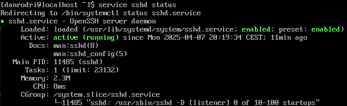

# SecureShell 
El protocolo SSH o Secure SHell también da nombre al propio programa que lo implementa, que nos permite el acceso remoto desde un cliente a un servidor.
El protocolo también permite copia segura, gestión de claves RSA y tunelización.

[...]

Comprobamos el estado del servicio con el siguiente comando.
```bash
service sshd status
```
Y nos devuelve esto:


El servicio se encuentra activo, y nos remite a dos páginas de la documentación; **man 8 sshd** y **man 5 sshd_config**.

El manual de sshd nos indica cómo configurar el servidor desde la línea de comandos, lo que no nos interesa en este momento.

El manual de sshd_config, sin embargo, nos indica que el fichero desde el cual sshd lee su configuración se encuentra en la ruta **/etc/ssh/sshd_config**.

